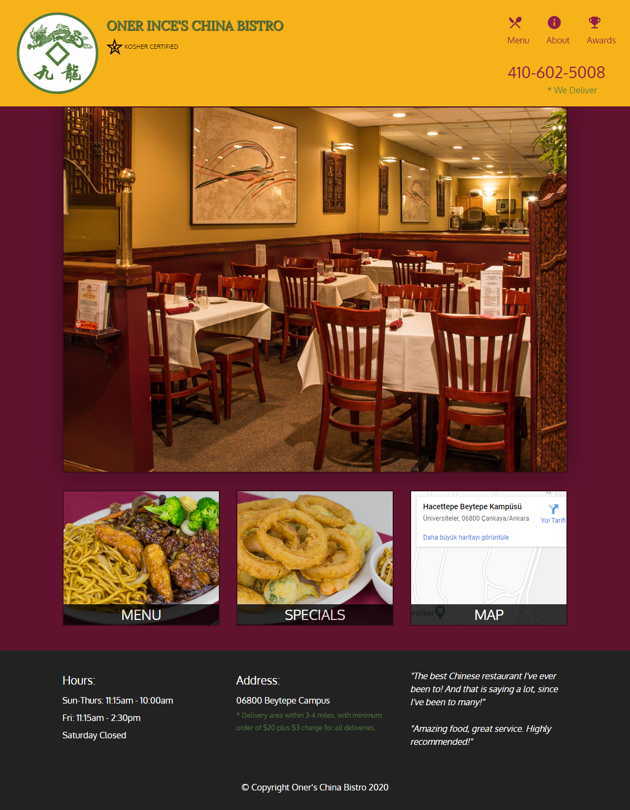
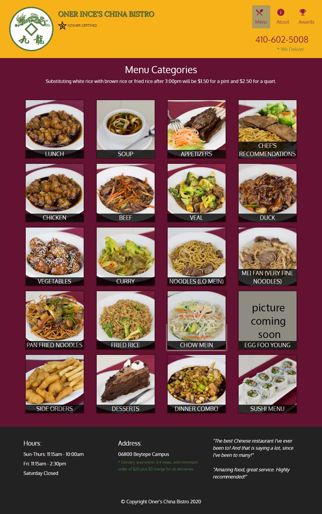
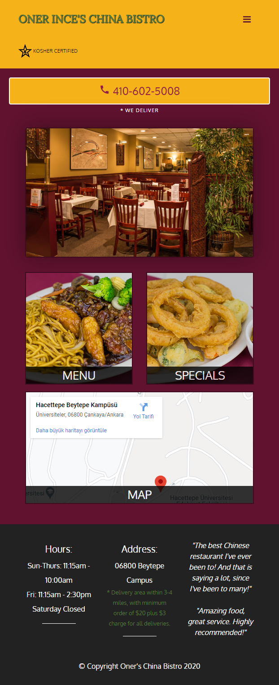

  

<h3 align="center">Restaurant Site</h3>

---

This is the final project of the "HTML, CSS, and Javascript for Web Developers" course taught by Yaakov Chaikin from Johns Hopkins University on Coursera platform. It is a single page design, responsive website which is built from scratch using Bootsrap 4 and Javascript. 

## 🎥 Screenshot 

<h4>Desktop / Tablet</h4>

<h4>Mobile</h4>

## 🎉 Acknowledgements 
* [Bootstrap Documentation](https://getbootstrap.com/)
* [Mozilla Developer Network](https://developer.mozilla.org/tr/) - Javascript documentation
