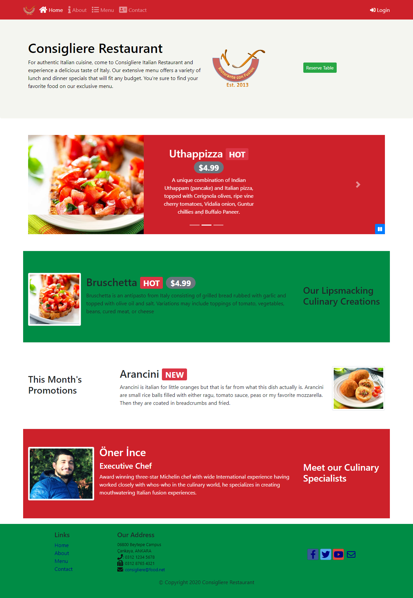

  

<h3 align="center">Italian Restaurant Site</h3>

---

This is the final project of the "Front-End Web UI Frameworks and Tools: Bootstrap 4" course taught by Jogesh K. Muppala from Hong Kong University on Coursera platform. It is a multi-page responsive website which is built from scratch using Bootsrap 4 and Javascript. 

Live version : https://onerince.github.io/coursera-frontend/bootstrap_course/

## 🎥 Screenshot 

<h4>Desktop / Tablet</h4>

## 🎉 Acknowledgements 
* [Bootstrap Documentation](https://getbootstrap.com/)
* [Font Awesome](https://fontawesome.com/)
* [Mozilla Developer Network](https://developer.mozilla.org/tr/) - Javascript documentation
